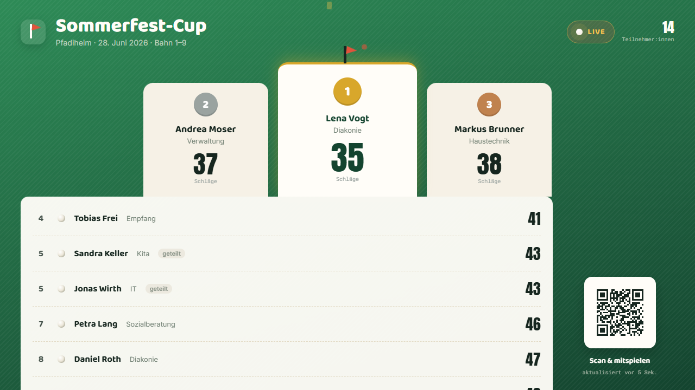
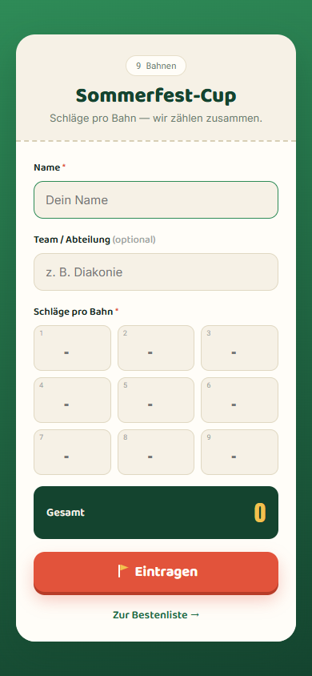
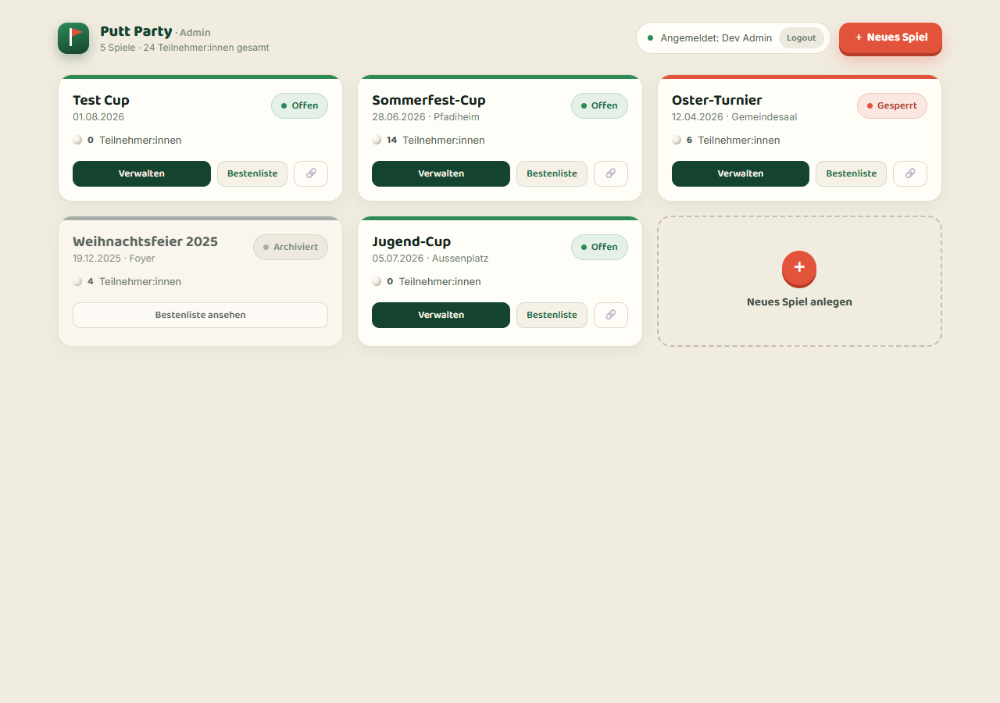
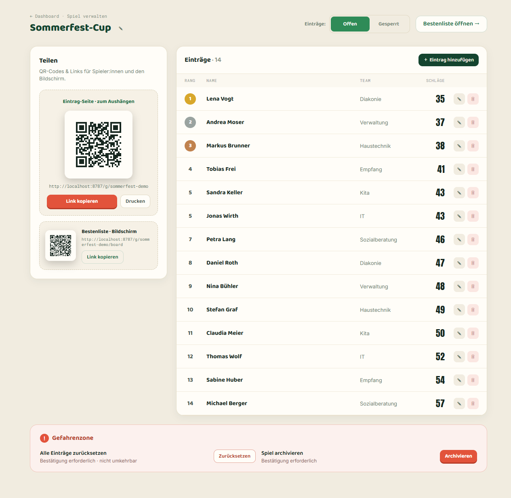

# Putt Party 🏌️

A self-hosted, live mini-golf tournament leaderboard for staff parties. One
deployment hosts **many independent games**: an organiser creates a game, players
scan a QR code to submit their score from their phone, and a big screen shows a
**live-updating** leaderboard. Public copy is German.

Built on **Cloudflare Workers** — TypeScript, [Hono](https://hono.dev) (router +
JSX SSR), **D1** (SQLite) as the source of truth, one **Durable Object per game**
for realtime, [htmx](https://htmx.org) for progressive enhancement, and
**Cloudflare Access** in front of `/admin`.

---

## Screenshots

| Live board (16:9) | Entry page (per-hole) |
| --- | --- |
|  |  |

| Admin dashboard | Manage game |
| --- | --- |
|  |  |

---

## Features

- **Public entry page** (`/g/:id`) — phone-first form, single total or per-hole
  (auto-summed) scoring per game, optional team field, inline validation,
  success/placement and locked states.
- **Live board** (`/g/:id/board`) — 16:9 big screen with podium, ranked list,
  tie ("geteilt") badges, ▲/▼ rank movement, a `LIVE` indicator, participant
  count and "last updated" — pushed over a WebSocket, with a polling fallback.
  Responsive mobile fallback included.
- **Admin** (`/admin`, behind Cloudflare Access) — dashboard of games, create/edit
  modal, manage page with shareable QR codes (entry + board, print-friendly),
  inline entries CRUD, status toggle, and a danger zone (reset / archive).
- **Server-generated QR codes** (SVG) pointing at the public routes.

## Architecture

| Concern | Choice |
| --- | --- |
| Runtime / router | Cloudflare Workers + Hono (JSX server components) |
| Source of truth | D1 (SQLite) via Drizzle ORM |
| Realtime | One `GameRoom` Durable Object per game (`idFromName(publicId)`), using the **WebSocket Hibernation API** + `setWebSocketAutoResponse` ping/pong. On any entry mutation the Worker writes D1 then calls the game's DO, which diffs standings (for ▲/▼), persists a snapshot, and broadcasts to every connected board. |
| Frontend | Server-rendered HTML; **htmx** for forms/admin, **partysocket** for the board socket (auto-reconnect) with a JSON polling fallback. |
| Admin auth | **Cloudflare Access** + in-Worker **JWT verification** (JWKS signature + `aud`) on every `/admin*` request. |
| QR codes | Generated server-side as SVG (`@paulmillr/qr`). |

### Project structure

```
wrangler.jsonc          Worker config: D1 + GameRoom DO bindings, static assets, workers.dev off
migrations/             D1 schema migrations (wrangler d1 migrations apply)
scripts/                seed.sql (demo data) + build-client.mjs (esbuild + vendored htmx)
public/                 app.css (design tokens/atoms) + built client bundles (board/entry/admin.js, htmx)
src/
  index.tsx             Hono app: mounts /g (public) and /admin, exports the DO
  db/                   Drizzle schema + queries
  lib/                  ranking, validation (zod), dates, ids (nanoid), qr, access (JWT)
  middleware/           requireAdmin (Access JWT guard + dev bypass)
  routes/               public.tsx, admin.tsx
  do/                   GameRoom.ts (hibernatable WS + broadcast), protocol.ts
  ui/                   layout, primitives, tokens, entry/*, board/*, admin/*
  client/               browser TS (board, entry, admin) — bundled by esbuild
test/                   ranking, validation, auth, integration (vitest pool-workers)
```

## Local development

Requires **Node 20+** (developed on Node 24).

```bash
npm install

# Local D1: apply schema + load demo data
npm run db:migrate:local
npm run db:seed:local

# Enable admin locally (no Cloudflare Access in dev)
cp .dev.vars.example .dev.vars      # ensure DEV_ADMIN_BYPASS="true"

npm run dev                          # builds client bundles, then `wrangler dev`
```

Then open:

- **Admin dashboard** — http://localhost:8787/admin
- **Demo entry page** — http://localhost:8787/g/sommerfest-demo
- **Demo live board** — http://localhost:8787/g/sommerfest-demo/board

Submit a score on the entry page (or another phone/tab) and watch the board
update live. Other demo games: `oster-demo` (locked), `jugend-demo` (empty),
`weihnachten-demo` (archived).

`npm run db:reset:local` re-applies migrations and re-seeds.

### Scoring & ranking

- Each game has an **entry mode**: `total` (one "Gesamtschläge" input) or
  `per_hole` (a grid of per-Bahn inputs summed to the total). The canonical
  stored value is always the **total**; lower is better.
- Ranking is **standard competition ranking** (1-2-2-4): tied players share the
  lower rank and the next rank skips — this matches the design's board, which
  shows ranks `4, 5, 5, 7` for scores `41, 43, 43, 46`. (The brief's parenthetical
  "dense ranking" was superseded by the concrete design.)

### Quality gates

```bash
npm test          # vitest (pool-workers): ranking/ties, validation, auth guard, entry->board, DO broadcast
npm run typecheck # tsc, server + client
npm run lint      # biome
npm run format    # biome --write
```

## Configuration (vars & bindings)

Set in `wrangler.jsonc` (`vars`) for production, overridden by `.dev.vars` locally.

| Name | Purpose |
| --- | --- |
| `APP_BASE_URL` | Public base URL used to build QR/share links, e.g. `https://puttparty.example`. |
| `ACCESS_TEAM_DOMAIN` | Cloudflare Access team domain, e.g. `myteam.cloudflareaccess.com` (no scheme). |
| `ACCESS_AUD` | The Access application's **Application Audience (AUD)** tag. |
| `DEV_ADMIN_BYPASS` | `"true"` only locally to skip Access. **Must be unset/`"false"` in production.** |

Bindings: `DB` (D1), `GAME_ROOM` (Durable Object), `ASSETS` (static assets).

## Deployment

1. **Create the D1 database** and put its id into `wrangler.jsonc` → `d1_databases[0].database_id`:
   ```bash
   wrangler d1 create puttparty-db
   ```
2. **Apply migrations** (and optionally seed) on the remote DB:
   ```bash
   npm run db:migrate
   # npm run db:seed   # optional demo data
   ```
3. **Set production vars** in `wrangler.jsonc` (`APP_BASE_URL`, `ACCESS_TEAM_DOMAIN`,
   `ACCESS_AUD`) — or as secrets via `wrangler secret put` if you prefer. Leave
   `DEV_ADMIN_BYPASS` as `"false"`.
4. **Deploy** and attach a custom domain (route). `workers_dev` is disabled in
   config so the `*.workers.dev` hostname is not served:
   ```bash
   npm run deploy
   ```

### Cloudflare Access setup for `/admin` (required)

Admin is protected by **two** layers: Cloudflare Access (the login wall) **and**
an in-Worker JWT check (so there is no unprotected path to admin code).

1. In the Cloudflare Zero Trust dashboard, create a **self-hosted Access
   application** for your domain with the path **`/admin`** (cover `/admin` and
   `/admin/*`).
2. Add a **policy** for who may access (e.g. your staff emails / IdP group).
3. Open the application's settings and copy its **Application Audience (AUD)**
   tag → set `ACCESS_AUD`.
4. Set `ACCESS_TEAM_DOMAIN` to your team domain (`<team>.cloudflareaccess.com`).
5. Redeploy. Every `/admin*` request is now verified in-Worker:
   - the `Cf-Access-Jwt-Assertion` token's RS256 signature is checked against
     `https://<team>.cloudflareaccess.com/cdn-cgi/access/certs`,
   - and its `aud` must equal `ACCESS_AUD`.
   Missing/invalid → **403**. The signed-in name comes from the JWT; **Logout**
   links to `/cdn-cgi/access/logout`.

> Without `ACCESS_TEAM_DOMAIN` / `ACCESS_AUD` set (and bypass off), `/admin`
> returns 403 by design.

## Security model

- **Public pages** (`/g/:id*`) need no login; their only protection is the
  unguessable `publicId` (nanoid). They contain no links to admin.
- **Admin** is gated by Cloudflare Access **and** the in-Worker JWT check, which
  runs on every admin route regardless of how it's reached. `workers.dev` is
  disabled so the custom domain (behind Access) is the only entrypoint.
- No secrets are committed; `.dev.vars` is git-ignored.
